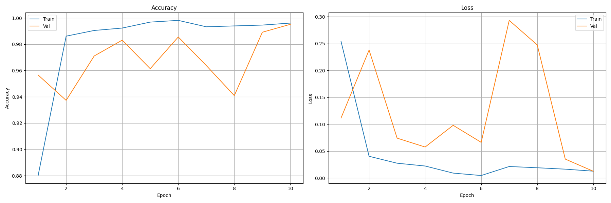
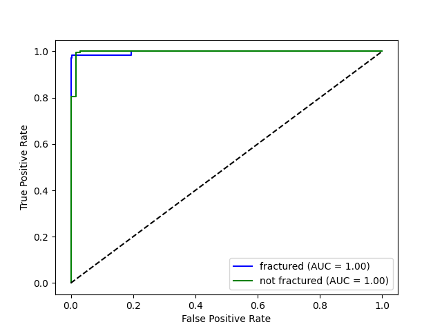
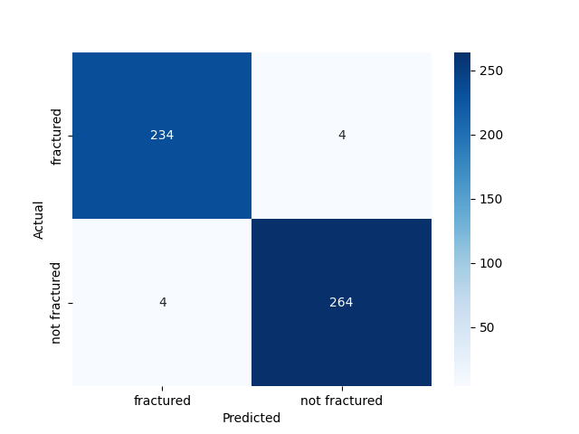
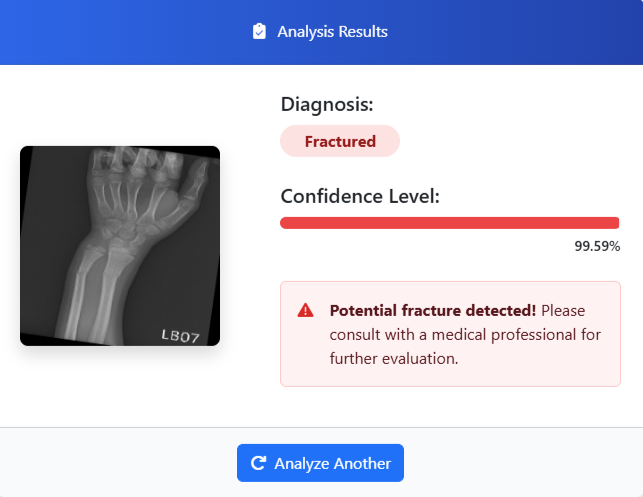
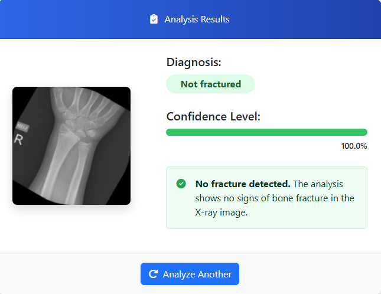

# 🩻 Fracture Detection System (Web AI App)

A professional **web application** built with **Flask** and **TensorFlow** to detect bone fractures in X-ray images with high accuracy.  
The model is based on **ResNet101** enhanced with **CBAM (Convolutional Block Attention Module)** for improved feature extraction.

> 📖 **License**: Licensed under the [MIT License](#-license)  
> ⚠ **Note**: To use the model, download it from Google Drive and place it in the `model` folder inside the project directory.  
> [📥 Download Model](https://drive.google.com/file/d/11dzRztVvQfnlqYvubLQ2OaVESjsz9q_D/view?usp=sharing)

---

## 💡 Overview

This system analyzes bone X-ray images and classifies them into:

- **Fractured**
- **Not Fractured**

It is designed to assist medical professionals and researchers by providing **fast** and **accurate** predictions through a **simple web interface**.

---

## 🎯 Model Performance

| Metric                 | Value    |
|------------------------|----------|
| **Training Accuracy**  | 99.87%   |
| **Validation Accuracy**| 99.52%   |
| **Testing Accuracy**   | 98.42%   |
| **Architecture**       | ResNet101 + CBAM |
| **Epochs**             | 10               |
| **Macro AUC**          | 0.9967   |


---

## 📈 Accuracy & Loss Curves

  

These plots show the training and validation performance of the fracture detection model over time.

---

## 📈 ROC Curve

  

The ROC curve shows the model’s ability to separate **fractured** from **not fractured** cases, with excellent class separation.

---

## 📊 Confusion Matrix

  

The confusion matrix summarizes classification results for both classes.

---

## 🧾 Classification Report

**Classes**: fractured, not fractured

```
                 precision    recall  f1-score   support

    fractured       0.98      0.98      0.98       238
not fractured       0.99      0.99      0.99       268

     accuracy                           0.98       506
    macro avg       0.98      0.98      0.98       506
 weighted avg       0.98      0.98      0.98       506
```

---

## 🏗 Model Architecture

- **Base Model**: ResNet101 (trained from scratch)
- **Attention Module**: CBAM for channel & spatial attention
- **Pooling**: GlobalAveragePooling2D
- **Dense Layers**: 256 units (ReLU), Dropout
- **Output**: Softmax for binary classification

---

## 🖥 Web Application

The application allows users to upload an X-ray image, processes it through the trained model, and returns:

- Prediction label (**fractured** / **not fractured**)
- Confidence score
- Display of the uploaded image alongside the prediction

---

## 🧪 Example Predictions

**Fractured**  
  

**Not Fractured**  
  

---

## ▶ How to Run

### 1️⃣ Clone the Repository

```bash
git clone https://github.com/HoussemBouagal/fracture-detection.git
cd fracture-detection
```

### 2️⃣ Create Virtual Environment & Install Dependencies

```bash
python -m venv venv
source venv/bin/activate   # Linux/Mac
venv\Scripts\activate      # Windows

pip install -r requirements.txt
```

### 3️⃣ Download and Place the Model

⚠ **Important**: The trained model is not included in the repository.  
Download it from: [Google Drive](https://drive.google.com/file/d/1YcEMqlBmMx0nK2TWZVxDb-OpZTZHTg5n/view)  
Place it in:

```
project/model/fraction-model.keras
```

### 4️⃣ Run the Application

```bash
python app.py
```

Open your browser at:  
[http://127.0.0.1:5000](http://127.0.0.1:5000)

---

## 📦 Requirements

```
tensorflow >= 2.10.0
flask
pillow
numpy
werkzeug
```

---

## ✅ Features

- 📂 Upload X-ray images easily via the web interface  
- ⚡ Instant prediction with a confidence score  
- 🧠 Trained on high-quality fracture datasets  
- 🌐 Modern Flask-based web UI  
- 🖼 Side-by-side image display with prediction results  

---

## 📂 Project Structure

```
fracture-detection/
│
├── test/
│   ├── fractured/
│   └── not fractured/
├── app.py
├── templates/
│   └── index.html
├── assets/
│   ├── app_interface.png
│   ├── metrics_curves.png
│   ├── confusion_matrix.png
│   ├── fractured.png
│   ├── not fractured.png
│   └── roc_curve.png
├── static/
│   ├── uploads/
│   ├── img/
│   └── trauma.ico
├── model/
│   └── fraction-model.keras
├── requirements.txt
├── LICENSE                     
└── README.md
```

---

## 📄 License

Licensed under the **MIT License**.

---

## ⚠ Disclaimer

For **educational and research purposes only**.  
Not intended for clinical or diagnostic use.

---

## 👤 Author

**Houssem Bouagal**  
📧 [mouhamedhoussem813@gmail.com](mailto:mouhamedhoussem813@gmail.com)  
🔗 [LinkedIn](https://www.linkedin.com/in/houssem-eddine-bouagal-98025a297)  
🌐 [Portfolio](https://houssembouagal.github.io/Portfolio/)
